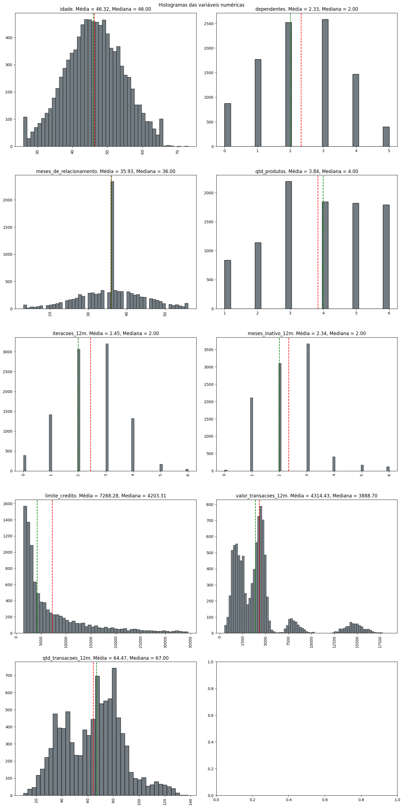
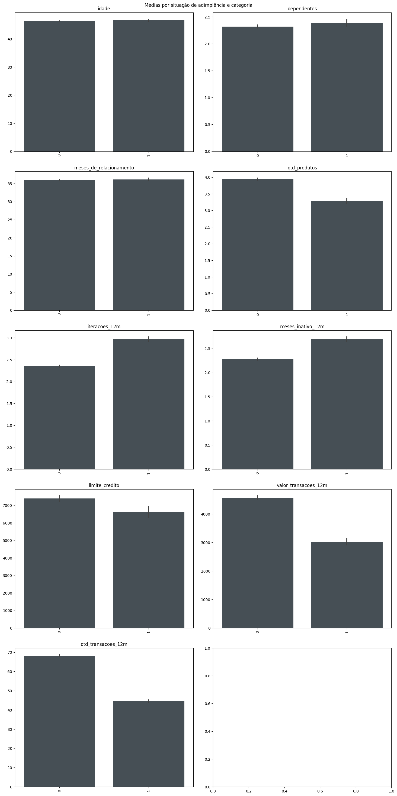
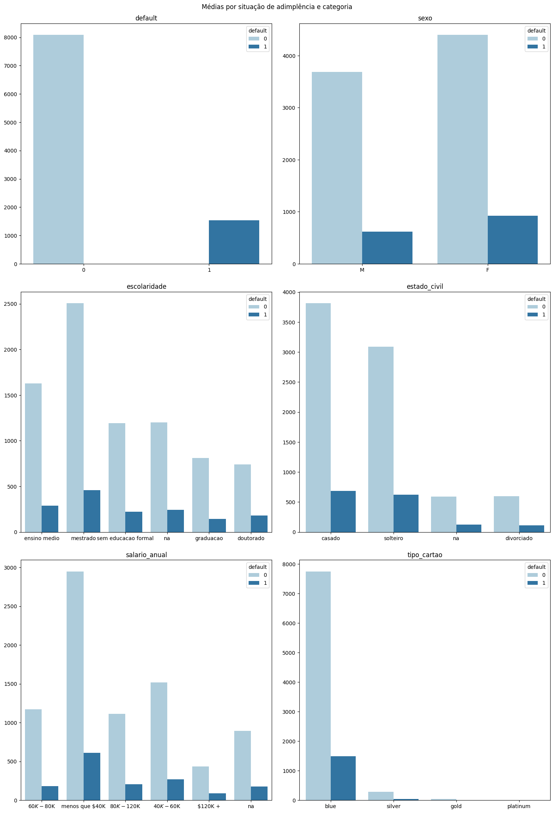
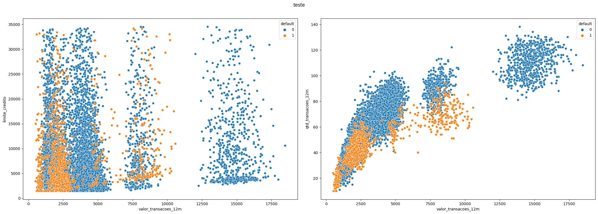
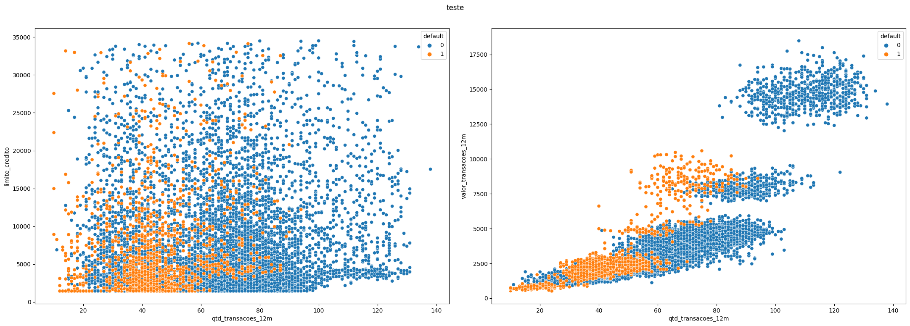

# Análise de Crédito - Projeto EBAC

**Conteúdo**<a id='toc0_'></a>    
- [Pré-processamento](#toc1_1_)    
    - [Importação das bibliotecas](#toc1_1_1_)    
    - [Definição de algumas funções utilizadas no notebook](#toc1_1_2_)    
  - [Carregamento da base e inspeção dos dados](#toc1_2_)    
    - [Carregamento, inspeção e modificações iniciais](#toc1_2_1_)    
    - [Entendimento da base de trabalho](#toc1_2_2_)    
  - [Visualização dos dados](#toc1_3_)    
    - [Investigação das colunas numéricas](#toc1_3_1_)    
    - [Verificação das variáveis categóricas](#toc1_3_2_)    
  - [Inspecionando as relações numéricas](#toc1_4_)    
  - [Conclusão](#toc1_5_)    

<!-- vscode-jupyter-toc-config
	numbering=false
	anchor=true
	flat=false
	minLevel=1
	maxLevel=6
	/vscode-jupyter-toc-config -->
<!-- THIS CELL WILL BE REPLACED ON TOC UPDATE. DO NOT WRITE YOUR TEXT IN THIS CELL -->

Esse notebook documenta o processo de análise de crédito de clientes de uma base fictícia, criada pelo professor André Perez, da EBAC. O processo de concessão de crédito é normalmente complexo e envolve uma série de variáveis, por isso, é importante traçar uma estratégia eficiente na segmentação dos clientes a fim de não perder possíveis clientes pagantes e não aumentar os índices de inadimplência. Esse notebook realiza o processamento dos dados do dataset, além da limpeza, "feature engeneering" e visualização das variáveis da base.

## <a id='toc1_1_'></a>[Pré-processamento](#toc0_)

### <a id='toc1_1_1_'></a>[Importação das bibliotecas](#toc0_)


```python
import pandas as pd #v2.0.2
import matplotlib.pyplot as plt  #v3.6.3
import seaborn as sns #v0.12.2
```

### <a id='toc1_1_2_'></a>[Definição de algumas funções utilizadas no notebook](#toc0_)


```python
def plota_variaveis_numericas(dataframe: pd.DataFrame, conjunto: list, alvo: str, titulo: str, modo='barra', tamanho_figura = (15,30), i=0) -> None:
    nrows = int(round(len(conjunto)/2, 0))
    
    if nrows < (len(conjunto)/2):
        nrows += 1

    fig, axes = plt.subplots(ncols=2, nrows=nrows, figsize=tamanho_figura, facecolor='white')
    axes = axes.flatten()
    fig.suptitle(titulo)
    #fig.subplots_adjust(hspace=0.8, wspace=0.3)


    for item in conjunto:
        if modo == 'barra':
            sns.barplot(x=dataframe[alvo], y=dataframe[item], ax=axes[i], color='#435058')
            axes[i].set_title(item)

        elif modo=='histograma':
            sns.histplot(x=dataframe[item], ax=axes[i], color='#435058')
            axes[i].axvline(x=dataframe[item].mean(), linestyle='--', color='red')
            axes[i].axvline(x=dataframe[item].median(), linestyle='--', color='green')
            axes[i].set_title(item + '. Média = {:.2f}, Mediana = {:.2f}'.format(dataframe[item].mean(), dataframe[item].median()))

        if dataframe[item].nunique() > 6:
            axes[i].xaxis.set_tick_params(rotation=90)

        axes[i].set_ylabel('')
        axes[i].set_xlabel('')
        i += 1
   
    fig.tight_layout(pad=2)

def plota_contagens(dataframe: pd.DataFrame, conjunto: list, alvo: str, titulo: str, tamanho_figura = (15,22), i=0) -> None:
    nrows = int(round(len(conjunto)/2, 0))

    if nrows < (len(conjunto)/2):
        nrows += 1

    fig, axes = plt.subplots(ncols=2, nrows=nrows, figsize=tamanho_figura, facecolor='white')
    axes = axes.flatten()
    fig.suptitle(titulo)

    for item in conjunto:
        sns.countplot(x=dataframe[item], ax=axes[i], palette='Paired', hue=dataframe[alvo])
        axes[i].set_title(item)
        axes[i].set_ylabel('')
        axes[i].set_xlabel('')
        i += 1
        
    fig.tight_layout(pad=2)


def plota_dispersao(dataframe: pd.DataFrame, conjunto: list, var: str, titulo: str, legenda=None, tamanho_figura = (20,12), i=0) -> None:
    nrows = int(round(len(conjunto)/2, 0))

    if nrows < (len(conjunto)/2):
        nrows += 1

    fig, axes = plt.subplots(ncols=2, nrows=nrows, figsize=tamanho_figura, facecolor='white')
    axes = axes.flatten()
    fig.suptitle(titulo)


    for item in conjunto:
        if legenda is not None:
            sns.scatterplot(x=dataframe[var], y=dataframe[item], ax=axes[i], hue=dataframe[legenda])
        else:
            sns.scatterplot(x=dataframe[var], y=dataframe[item], ax=axes[i])

        i += 1
    fig.tight_layout(pad=2)

```

## <a id='toc1_2_'></a>[Carregamento da base e inspeção dos dados](#toc0_)

### <a id='toc1_2_1_'></a>[Carregamento, inspeção e modificações iniciais](#toc0_)


```python
df = pd.read_csv('dados_credito.csv')
```


```python
df.head()
```


<div>
<style scoped>
    .dataframe tbody tr th:only-of-type {
        vertical-align: middle;
    }

    .dataframe tbody tr th {
        vertical-align: top;
    }

    .dataframe thead th {
        text-align: right;
    }
</style>
<table border="1" class="dataframe">
  <thead>
    <tr style="text-align: right;">
      <th></th>
      <th>id</th>
      <th>default</th>
      <th>idade</th>
      <th>sexo</th>
      <th>dependentes</th>
      <th>escolaridade</th>
      <th>estado_civil</th>
      <th>salario_anual</th>
      <th>tipo_cartao</th>
      <th>meses_de_relacionamento</th>
      <th>qtd_produtos</th>
      <th>iteracoes_12m</th>
      <th>meses_inativo_12m</th>
      <th>limite_credito</th>
      <th>valor_transacoes_12m</th>
      <th>qtd_transacoes_12m</th>
    </tr>
  </thead>
  <tbody>
    <tr>
      <th>0</th>
      <td>768805383</td>
      <td>0</td>
      <td>45</td>
      <td>M</td>
      <td>3</td>
      <td>ensino medio</td>
      <td>casado</td>
      <td>$60K - $80K</td>
      <td>blue</td>
      <td>39</td>
      <td>5</td>
      <td>3</td>
      <td>1</td>
      <td>12.691,51</td>
      <td>1.144,90</td>
      <td>42</td>
    </tr>
    <tr>
      <th>1</th>
      <td>818770008</td>
      <td>0</td>
      <td>49</td>
      <td>F</td>
      <td>5</td>
      <td>mestrado</td>
      <td>solteiro</td>
      <td>menos que $40K</td>
      <td>blue</td>
      <td>44</td>
      <td>6</td>
      <td>2</td>
      <td>1</td>
      <td>8.256,96</td>
      <td>1.291,45</td>
      <td>33</td>
    </tr>
    <tr>
      <th>2</th>
      <td>713982108</td>
      <td>0</td>
      <td>51</td>
      <td>M</td>
      <td>3</td>
      <td>mestrado</td>
      <td>casado</td>
      <td>$80K - $120K</td>
      <td>blue</td>
      <td>36</td>
      <td>4</td>
      <td>0</td>
      <td>1</td>
      <td>3.418,56</td>
      <td>1.887,72</td>
      <td>20</td>
    </tr>
    <tr>
      <th>3</th>
      <td>769911858</td>
      <td>0</td>
      <td>40</td>
      <td>F</td>
      <td>4</td>
      <td>ensino medio</td>
      <td>na</td>
      <td>menos que $40K</td>
      <td>blue</td>
      <td>34</td>
      <td>3</td>
      <td>1</td>
      <td>4</td>
      <td>3.313,03</td>
      <td>1.171,56</td>
      <td>20</td>
    </tr>
    <tr>
      <th>4</th>
      <td>709106358</td>
      <td>0</td>
      <td>40</td>
      <td>M</td>
      <td>3</td>
      <td>sem educacao formal</td>
      <td>casado</td>
      <td>$60K - $80K</td>
      <td>blue</td>
      <td>21</td>
      <td>5</td>
      <td>0</td>
      <td>1</td>
      <td>4.716,22</td>
      <td>816,08</td>
      <td>28</td>
    </tr>
  </tbody>
</table>
</div>


A partir da inspeção inicial da base de dados é possível observar que algumas colunas foram importadas com o tipo errado. As colunas "limite_credito" e "valor_transacoes_12m" deveriam ser lidas como colunas de tipo numérico, mas foram importadas como objetos porque possuem pontos e vírgulas que o pandas não entende. Nesse caso, é importante corrigir o tipo das colunas


```python
df['limite_credito'] = df['limite_credito'].apply(lambda x: float(x.replace('.','').replace(',', '.')))
df['valor_transacoes_12m'] = df['valor_transacoes_12m'].apply(lambda x: float(x.replace('.','').replace(',', '.')))
```

### <a id='toc1_2_2_'></a>[Entendimento da base de trabalho](#toc0_)

A base possui pouco mais de 10.000 entradas, com colunas numéricas do tipo int e categóricas do tipo object. Nenhuma coluna apresenta valor nulo.


```python
print(df.shape)
df.info()
```

    (10127, 16)
    <class 'pandas.core.frame.DataFrame'>
    RangeIndex: 10127 entries, 0 to 10126
    Data columns (total 16 columns):
     #   Column                   Non-Null Count  Dtype  
    ---  ------                   --------------  -----  
     0   id                       10127 non-null  int64  
     1   default                  10127 non-null  int64  
     2   idade                    10127 non-null  int64  
     3   sexo                     10127 non-null  object 
     4   dependentes              10127 non-null  int64  
     5   escolaridade             10127 non-null  object 
     6   estado_civil             10127 non-null  object 
     7   salario_anual            10127 non-null  object 
     8   tipo_cartao              10127 non-null  object 
     9   meses_de_relacionamento  10127 non-null  int64  
     10  qtd_produtos             10127 non-null  int64  
     11  iteracoes_12m            10127 non-null  int64  
     12  meses_inativo_12m        10127 non-null  int64  
     13  limite_credito           10127 non-null  float64
     14  valor_transacoes_12m     10127 non-null  float64
     15  qtd_transacoes_12m       10127 non-null  int64  
    dtypes: float64(2), int64(9), object(5)
    memory usage: 1.2+ MB
    

Para facilitar o entendimento da base, são feitas análises a partir dos tipos das colunas


```python
df = df.drop('id', axis=1) #A coluna id é uma chave primária que não ajuda na análise dos dados
df['default'] = df['default'].astype('object') #A coluna default é um valor binário, a conversão para variável categórica ajuda na análise

v_resp = 'default' #indica se o cliente é inadimplente (1) ou não (0)
v_num = df.select_dtypes(include=['int', 'float']).columns
v_cat = df.select_dtypes(include=['object']).columns
```


```python
df.describe(exclude='object').transpose() 
```


<div>
<style scoped>
    .dataframe tbody tr th:only-of-type {
        vertical-align: middle;
    }

    .dataframe tbody tr th {
        vertical-align: top;
    }

    .dataframe thead th {
        text-align: right;
    }
</style>
<table border="1" class="dataframe">
  <thead>
    <tr style="text-align: right;">
      <th></th>
      <th>count</th>
      <th>mean</th>
      <th>std</th>
      <th>min</th>
      <th>25%</th>
      <th>50%</th>
      <th>75%</th>
      <th>max</th>
    </tr>
  </thead>
  <tbody>
    <tr>
      <th>idade</th>
      <td>10127.0</td>
      <td>46.325960</td>
      <td>8.016814</td>
      <td>26.00</td>
      <td>41.000</td>
      <td>46.00</td>
      <td>52.000</td>
      <td>73.00</td>
    </tr>
    <tr>
      <th>dependentes</th>
      <td>10127.0</td>
      <td>2.346203</td>
      <td>1.298908</td>
      <td>0.00</td>
      <td>1.000</td>
      <td>2.00</td>
      <td>3.000</td>
      <td>5.00</td>
    </tr>
    <tr>
      <th>meses_de_relacionamento</th>
      <td>10127.0</td>
      <td>35.928409</td>
      <td>7.986416</td>
      <td>13.00</td>
      <td>31.000</td>
      <td>36.00</td>
      <td>40.000</td>
      <td>56.00</td>
    </tr>
    <tr>
      <th>qtd_produtos</th>
      <td>10127.0</td>
      <td>3.812580</td>
      <td>1.554408</td>
      <td>1.00</td>
      <td>3.000</td>
      <td>4.00</td>
      <td>5.000</td>
      <td>6.00</td>
    </tr>
    <tr>
      <th>iteracoes_12m</th>
      <td>10127.0</td>
      <td>2.455317</td>
      <td>1.106225</td>
      <td>0.00</td>
      <td>2.000</td>
      <td>2.00</td>
      <td>3.000</td>
      <td>6.00</td>
    </tr>
    <tr>
      <th>meses_inativo_12m</th>
      <td>10127.0</td>
      <td>2.341167</td>
      <td>1.010622</td>
      <td>0.00</td>
      <td>2.000</td>
      <td>2.00</td>
      <td>3.000</td>
      <td>6.00</td>
    </tr>
    <tr>
      <th>limite_credito</th>
      <td>10127.0</td>
      <td>8632.440165</td>
      <td>9088.788041</td>
      <td>1438.00</td>
      <td>2555.355</td>
      <td>4549.42</td>
      <td>11068.175</td>
      <td>34516.99</td>
    </tr>
    <tr>
      <th>valor_transacoes_12m</th>
      <td>10127.0</td>
      <td>4404.583047</td>
      <td>3397.128078</td>
      <td>510.16</td>
      <td>2155.825</td>
      <td>3899.59</td>
      <td>4741.310</td>
      <td>18484.93</td>
    </tr>
    <tr>
      <th>qtd_transacoes_12m</th>
      <td>10127.0</td>
      <td>64.858695</td>
      <td>23.472570</td>
      <td>10.00</td>
      <td>45.000</td>
      <td>67.00</td>
      <td>81.000</td>
      <td>139.00</td>
    </tr>
  </tbody>
</table>
</div>


Um perfil médio de cliente pode ser considerado como o de uma pessoa com cerca de 46 anos, 2 dependentes e contratação de 3 produtos. O limite de crédito média é de R$8632, no entanto, esse valor deve ser revisado, uma vez que o alto valor do desvio padrão e a diferença entre o 3° quartil e o valor máximo indicam que podem existir outliers influenciando a média nessa categoria. Situação semelhante ocorre com o valor das transações.


```python
_ = df.describe(include='object').transpose()
_['freq_perc'] = _['freq'].apply(lambda x: round((x/len(df))*100), 2) #Apenas para obter o valor percentual da frequência
_
```


<div>
<style scoped>
    .dataframe tbody tr th:only-of-type {
        vertical-align: middle;
    }

    .dataframe tbody tr th {
        vertical-align: top;
    }

    .dataframe thead th {
        text-align: right;
    }
</style>
<table border="1" class="dataframe">
  <thead>
    <tr style="text-align: right;">
      <th></th>
      <th>count</th>
      <th>unique</th>
      <th>top</th>
      <th>freq</th>
      <th>freq_perc</th>
    </tr>
  </thead>
  <tbody>
    <tr>
      <th>default</th>
      <td>10127</td>
      <td>2</td>
      <td>0</td>
      <td>8500</td>
      <td>84</td>
    </tr>
    <tr>
      <th>sexo</th>
      <td>10127</td>
      <td>2</td>
      <td>F</td>
      <td>5358</td>
      <td>53</td>
    </tr>
    <tr>
      <th>escolaridade</th>
      <td>10127</td>
      <td>6</td>
      <td>mestrado</td>
      <td>3128</td>
      <td>31</td>
    </tr>
    <tr>
      <th>estado_civil</th>
      <td>10127</td>
      <td>4</td>
      <td>casado</td>
      <td>4687</td>
      <td>46</td>
    </tr>
    <tr>
      <th>salario_anual</th>
      <td>10127</td>
      <td>6</td>
      <td>menos que $40K</td>
      <td>3561</td>
      <td>35</td>
    </tr>
    <tr>
      <th>tipo_cartao</th>
      <td>10127</td>
      <td>4</td>
      <td>blue</td>
      <td>9436</td>
      <td>93</td>
    </tr>
  </tbody>
</table>
</div>


Todas as variáveis categóricas tem cardinalidade relativamente baixa, sendo as variáveis de escolaridade e salário_anual as com maior número de distinções. A base é relativamente equiparada em relação aos dados de gênero e estado cívil e bem desbalanceada em relação ao tipo de cartão do cliente. Quase 1/3 dos clientes possuem mestrado e mais de 35% dos usuários possuem renda menor que 40 mil anuais (a categoria mais baixa).
A inspeção da variável resposta indica que "apenas" 16% dos clientes são inadimplentes, o que indica um desbalanceamento do dataset em relação à variável resposta.

## <a id='toc1_3_'></a>[Visualização dos dados](#toc0_)

A visualização inicial da base já deu algum panorama sobre o comportamento das colunas, mas a visualização gráficas dessas deve ajudar a consolidar o conhecimento sobre os dados trabalhados. Além disso, a grande discrepância entre o número de adimplentes e inadimplentes faz necessária uma segregação de colunas a partir dessas categorias, visando o entendimento do perfil relacionado a esses dois tipos de clientes.

### <a id='toc1_3_1_'></a>[Investigação das colunas numéricas](#toc0_)


```python
plota_variaveis_numericas(dataframe=df, conjunto=v_num, alvo=v_resp, titulo='Histogramas das variáveis numéricas', modo='histograma')
```


    

    


Algumas colunas tem distribuições muito desbalanceadas e que interferem no valor da média, indicativos disso são as distribuição com cauda alongada e as grandes diferenças entre média e mediana. Tomando esses parâmetros como horizonte de decisão e procurando diminuir o mínimo possível o número de observações na base, decidi remover os valores outliers da variável de limite de crédito. A remoção dos valores correspondentes aos 5% maiores deve dar um quadro mais factível da situação dos clientes.


```python
df = df[df['limite_credito'] < df['limite_credito'].quantile(0.95)]
print(df.shape)

_ = df.describe(include='object').transpose() 
_['freq_perc'] = _['freq'].apply(lambda x: round((x/len(df))*100), 2) #Apenas para obter o valor percentual da frequência
_
```

    (9620, 15)
    


<div>
<style scoped>
    .dataframe tbody tr th:only-of-type {
        vertical-align: middle;
    }

    .dataframe tbody tr th {
        vertical-align: top;
    }

    .dataframe thead th {
        text-align: right;
    }
</style>
<table border="1" class="dataframe">
  <thead>
    <tr style="text-align: right;">
      <th></th>
      <th>count</th>
      <th>unique</th>
      <th>top</th>
      <th>freq</th>
      <th>freq_perc</th>
    </tr>
  </thead>
  <tbody>
    <tr>
      <th>default</th>
      <td>9620</td>
      <td>2</td>
      <td>0</td>
      <td>8082</td>
      <td>84</td>
    </tr>
    <tr>
      <th>sexo</th>
      <td>9620</td>
      <td>2</td>
      <td>F</td>
      <td>5318</td>
      <td>55</td>
    </tr>
    <tr>
      <th>escolaridade</th>
      <td>9620</td>
      <td>6</td>
      <td>mestrado</td>
      <td>2967</td>
      <td>31</td>
    </tr>
    <tr>
      <th>estado_civil</th>
      <td>9620</td>
      <td>4</td>
      <td>casado</td>
      <td>4497</td>
      <td>47</td>
    </tr>
    <tr>
      <th>salario_anual</th>
      <td>9620</td>
      <td>6</td>
      <td>menos que $40K</td>
      <td>3561</td>
      <td>37</td>
    </tr>
    <tr>
      <th>tipo_cartao</th>
      <td>9620</td>
      <td>4</td>
      <td>blue</td>
      <td>9239</td>
      <td>96</td>
    </tr>
  </tbody>
</table>
</div>


Como o percentual de participação de adimplentes e inadimplentes na base não foi alterado a partir da remoção das linhas, a análise não será prejudicada. O próximo passo é verificar a média dos valores numéricos em relação a cada categoria da variável resposta, a ideia aqui é identificar variáveis de diferenciação entre adimplentes e inadimplentes


```python
plota_variaveis_numericas(dataframe=df, conjunto=v_num, alvo=v_resp, titulo='Médias por situação de adimplência e categoria', modo='barra')
```


    

    


As maiores diferenciações entre clientes adimplentes e inadimplentes estão na quantidade de transações realizadas dentro do período de um ano e no valor dessas transações, clientes inadimplentes realizaram menos transações, com menor valor em média. Além disso, clientes inadimplentes ficaram mais meses inativos e realizaram um número maior de iterações. clientes inadimplentes tem, em média, menor quantidade de crédito disponível. 

### <a id='toc1_3_2_'></a>[Verificação das variáveis categóricas](#toc0_)


```python
plota_contagens(dataframe=df, conjunto=v_cat, alvo=v_resp, titulo='Médias por situação de adimplência e categoria')
```


    

    


A dinâmica de participação de adimplentes e inadimplentes é muito semelhante entre todas as variáveis categóricas visualizadas. Isso significa que a inadimplência do usuário não está relacionada a uma categoria específica de alguma das variáveis categóricas da base.

## <a id='toc1_4_'></a>[Inspecionando as relações numéricas](#toc0_)

Anteriormente foi possível obter bons insights a partir das variáveis numéricas. Nesse momento, interessa entender a relação de dispersão entre as variáveis numéricas contínuas e sua relação com a situação de adimplência. Assim, é possível verificar diferenças no perfil do cliente inadimplente em relação aos outros. Para a visualização da relação de dispersão foram selecionadas as variáveis numéricas que ocasionam maior distinção entre os tipos de cliente: quantidade de transações, valor dessas transações e limite de crédito. 


```python
plota_dispersao(dataframe=df, conjunto=['limite_credito', 'qtd_transacoes_12m'], var='valor_transacoes_12m', titulo='teste', legenda='default', tamanho_figura=(22,8))
```


    

    


```python
plota_dispersao(dataframe=df, conjunto=['limite_credito', 'valor_transacoes_12m'], var='qtd_transacoes_12m', titulo='teste', legenda='default', tamanho_figura=(22,8))
```


    

    


Há forte relação entre a quantidade de transações e o valor das mesmas, o que indica que clientes que utilizam mais a funcionalidade do cartão tendem a gastar mais com o mesmo. Além disso, há uma clara distinção no perfil de gasto entre clientes adimplentes e inadimplentes, na medida em que clientes inadimplentes tendem a realizar um número médio de transações consideralvemente menor, com menor valor médio das operações. O limite de crédito parece não apresentar distinção significativa entre clientes dos dois tipos.

## <a id='toc1_5_'></a>[Conclusão](#toc0_)


A exploração dos dados de crédito aponta que várias das características de perfil são semelhantes entre clientes adimplentes e inadimplentes, assim, é difícil diferenciá-los a partir de qualquer característica individual. No entanto, é possível verificar diferenças entre os grupos de adimplentes e inadimplentes a partir do uso do cartão de crédito: em um geral, os clientes inadimplentes tendem a utilizar menos o cartão e gastam menos com as transações, contratam menos produtos e deixam de utilizar o cartão por maiores períodos de tempo. Um modelo eficiente de diferenciação do tipo de cliente, a fim de verificar possíveis candidatos ao aumento de crédito, deve considerar principalmente as características de uso do cartão. Devem ser considerados mais aptos para a concessão de crédito os clientes ativos, com uso regular do cartão e que dispendem mais dinheiro nas transções.
